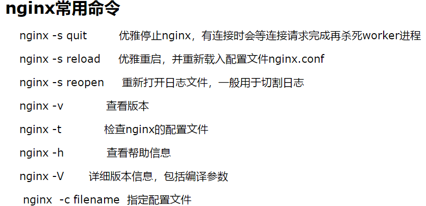

# explorer环境搭建

## 前端：
### 安装nodjs
下载：https://nodejs.org/en/download/

安装：https://github.com/nodejs/help/wiki/Installation

### 编译和测试环境运行
需要修改src\assets\utility.js中的getNebulasNetHost函数，更改节点地址
```bash
# install dependency
cd explorer/explorer-front
npm i

# run webpack dev build on localhost
npm run dev

# open http://localhost:8080/ in browser
# config port number in explorer-front/config/index.js!dev.port

# run webpack production build, results will output to 'dist' folder
npm run build
```

### Nginx搭建
下载：http://nginx.org/en/download.html

安装：http://nginx.org/en/linux_packages.html#Ubuntu

上一步骤编译完成之后，生成的代码位于explorer/explorer-front/dist
需要在/etc/nginx目录下面生成配置文件，如explorer.conf，下面是一个例子：
```bash
pid        /var/run/nginx.pid;

http {
        include  /etc/nginx/mime.types;
        default_type application/octet-stream;
        sendfile on;
        server {
                listen 80;
                root /data/guangyu/explorer/explorer-front/dist;
                index index.html;
                location /static/css {
                        add_header  Content-Type    text/css;
                }
        }
        server {
                listen 8090;
                location /api {
                        proxy_pass http://127.0.0.1:32736/api;
                }
        }
}
events {
        worker_connections  1024;
}

```

### 启动nginx和常用命令
```bash
#启动
sudo nginx -c explorer.conf
#退出
sudo nginx -s quit

```

下面是常用的命令：


## 后端
### 安装java

```bash
# 下载
wget https://github.com/frekele/oracle-java/releases/download/8u212-b10/jdk-8u212-linux-x64.tar.gz
# 创建目录:
sudo mkdir /usr/lib/jvm
# 解压缩到该目录:
sudo tar -zxvf jdk-7u60-linux-x64.gz -C /usr/lib/jvm
# 修改环境变量:
sudo vi ~/.bashrc
# 在文件末尾追加下面内容：
#set oracle jdk environment
export JAVA_HOME=/usr/lib/jvm/jdk1.8.0_144  ## 这里要注意目录要换成自己解压的jdk 目录
export JRE_HOME=${JAVA_HOME}/jre  
export CLASSPATH=.:${JAVA_HOME}/lib:${JRE_HOME}/lib  
export PATH=${JAVA_HOME}/bin:$PATH  
# 使环境变量马上生效：
source ~/.bashrc
# 系统注册此jdk
sudo update-alternatives –install /usr/bin/java java /usr/lib/jvm/jdk1.7.0_60/bin/java 300
#查看java版本，看看是否安装成功：
java -version
```

### 安装Mysql
```bash
sudo apt-get install mysql-server
sudo apt install mysql-client
sudo apt install libmysqlclient-dev
测试是否安装成功：sudo netstat -tap | grep mysql，出现下图说明成功
```


### 安装Redis
下载和安装：https://redis.io/download


### 配置
```bash
# 远程调用
/etc/mysql/mysql.conf.d/mysqld.cnf  注释掉bind-address = 127.0.0.1

# Mysql更改存储位置：
sudo /etc/init.d/mysql stop
service mysql stop停止服务
sudo cp -rf /var/lib/mysql /data/guangyu/database
sudo vim /etc/mysql/mysql.conf.d/mysqld.cnf  修改datadir和basedir
basedir         = /data/database/
datadir         = /data/database/mysql/
sudo /etc/init.d/mysql restart 

# 修改新位置的权限
sudo vim /etc/apparmor.d/usr.sbin.mysqld
/data/database/** rwk,
service apparmor restart
sudo mysqld --no-defaults --datadir=/data/database/mysql/ --basedir=/data/database/ --lc-messages-dir=/usr/share/mysql/ --initialize --lc-messages=en_US –initialize

# 注意临时root密码
chgrp -R mysql ./mysql/ && chown -R mysql ./mysql/
service mysql start
sudo netstat -tap | grep mysql
set password for root@localhost = password('123456');
mysql -uroot -p123456登录

# 新增用户名
CREATE USER 'explorer'@'localhost' IDENTIFIED BY '123456';

# 提升权限
GRANT ALL ON explorertest.* to 'explorer'@'localhost' IDENTIFIED BY '123456';

```

### 编译和运行
```bash
cd explorer/explorer-backend
source build-expl.sh
source start-expl.sh
source stop-expl.sh

```
